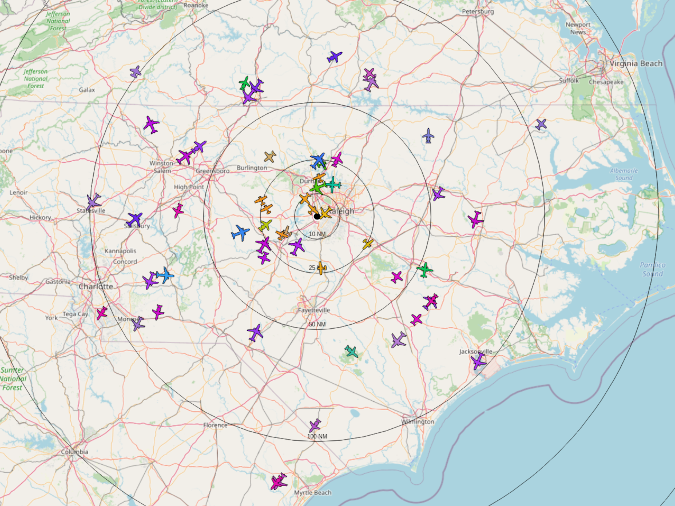

I live near a major airport, and I frequently hear aircraft flying over my house. I also have a curious preschooler, and I find myself answering questions like, "What's that?" and "Where's that plane going?" often. While a quick internet search could answer these questions, I wanted to see if I could answer them myself.

With a Raspberry Pi, an inexpensive radio, and open source software, I can track aircraft as far as 200 miles from my house. Whether you're answering relentless questions from your kids or are just curious about what's in the sky above you, this is something you can try, too.
<!--more-->

## The protocol behind it all
[ADS-B](https://en.wikipedia.org/wiki/Automatic_Dependent_Surveillance%E2%80%93Broadcast) is a technology that aircraft use worldwide to broadcast their location. Aircraft use position data gathered from GPS and periodically broadcast it along with speed and other telemetry so that other aircraft and ground stations can track their position.

Since this protocol is well-known and unencrypted, there are many solutions to receive and parse it, including many that are open source.

## Gathering the hardware
Pretty much any [Raspberry Pi](https://www.raspberrypi.org/) will work for this project. I've used an older Pi 1 Model B, but I'd recommend a Pi 3 or newer to ensure you can keep up with the stream of decoded ADS-B messages.

To receive the ADS-B signals, you need a software-defined radio. Thanks to ultra-cheap radio chips designed for TV tuners, there are quite a few cheap USB receivers to choose from. I use [FlightAware's ProStick Plus](https://www.amazon.com/FlightAware-FA-PROSTICKPLUS-1-Receiver-Built-Filter/dp/B01M7REJJW) because it has a built-in filter to weaken signals outside the 1090MHz band used for ADS-B. Filtering is important since strong signals, such as broadcast FM radio and television, can desensitize the receiver. Any receiver based on RTL-SDR should work.

You will also need an antenna for the receiver. The options are limitless here, ranging from the [more adventurous DIY options](http://www.radioforeveryone.com/p/easy-homemade-ads-b-antennas.html) to purchasing a [ready-made 1090MHz antenna](https://www.amazon.com/s?k=1090+antenna+sma&i=electronics&ref=nb_sb_noss_2). Whichever route you choose, antenna placement matters most. ADS-B reception is line-of-sight, so you'll want your antenna to be as high as possible to extend your range. I have mine in my attic, but I got decent results from my house's upper floor.

## Visualizing your data with software
Now that your Pi is equipped to receive ADS-B signals, the real magic happens in the software. Two of the most commonly used open source software projects for ADS-B are [readsb](https://github.com/wiedehopf/readsb) for decoding ADS-B messages and [tar1090](https://github.com/wiedehopf/tar1090) for visualization. Combining both provides an interactive map showing all the aircraft your Pi is tracking.

Both projects provide setup instructions, but using a prebuilt image like the [ADSBx Custom Pi Image](https://www.adsbexchange.com/how-to-feed/adsbx-custom-pi-image/) is the fastest way to get going. The ADSBx image even configures a Prometheus instance with custom metrics like aircraft count.

## Keep experimenting
If the novelty of tracking airplanes with your Raspberry Pi wears off, there are plenty of ways to keep experimenting. Try different antenna designs or find the best antenna placement to maximize the number of aircraft you see.

These are just a few of the ways to track aircraft with your Pi, and hopefully, this inspires you to try it out and learn a bit about the world of radio. Happy tracking!

> This article was originally published on [Opensource.com](https://opensource.com/article/21/3/tracking-flights-raspberry-pi) and is licensed under Creative Commons SA-BY 4.0.
